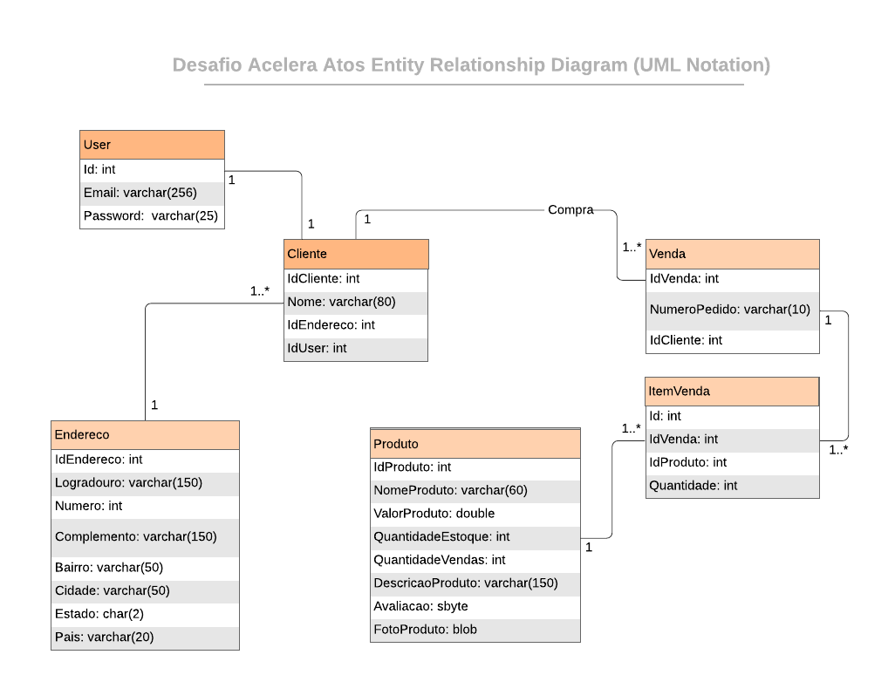

# Desafio Acelera Atos - Gama Academy (C#)

Este projeto tem por finalidade demonstrar os conhecimentos adquiridos durante o treinamento de aceleração [Acelera Atos .NET] by Gama Academy

  O Desafio é desenvolver microserviços em .NET para compor funções que atendam o negócio de uma empresa fictícia. Os microsserviços devem expor API’s atendendo o padrão Restful e com uma documentação no modelo Swagger.
  Construir uma outra aplicação com a única finalidade de consumir eventos e expor consulta desses eventos deve ser construída para consumir os eventos gerados pela API principal escolhida e que irá registrar esses eventos em banco de dados.

## Tecnologias Utilizadas

- .NET 6
- C#
- Oracle como banco de dados
- Swagger
- Dapper
- Entity Framework

## Desafios

- Criação de um microsserviço de Domínio e uma API consumidora dos eventos
- A estrutura de dados a serem criados deve ser coerente assim como os tipos de dados
- Deve conter uma entidade forte do Domínio, e que deve ter pelo menos um relacionamento um-para-muitos
- O microsserviço deve ter no mínimo 90% de cobertura nos testes
- A regra de negócio inserida no microsserviço fica a critério, porém quanto mais regras, melhor será o aproveitamento com os TDD’s
- Os testes de integração devem conter um fluxo com sucesso e um com validação para cada API criada (GET/POST/PUT/PATCH/DELETE)
- Disponibilizar uma documentação do microsserviço com Swagger
- Criar um desenho dos componentes a serem criados para abstrair os cenários

## Critérios de Avaliação

-  Boa práticas de Orientação a Objeto
- Validação de testes cobrindo o que realmente deve ser coberto
- Ao executar todas as funcionalidades devem ser executadas ou pelo Swagger ou pelo Postman, simulando uma integração entre os sistemas, sem erros sistêmicos, apenas com erros de validação de negócio será aceita

## Diagrama UML

  

## Estrutura

A WEB API utiliza MVC, e clean architecture.

(TODO: explicar sobre as camadas de controller, business e repository)

## Banco de Dados

A maioria das operações no banco de dados usa o entity framework mas algumas estão implementadas em Dapper. (TODO: Explicar onde e os motivos).

Utilizamos a mentalidade code-first, criando os Modelos no código C# e gerando o banco e as tabelas correspondentes com o Migration do entity framework.

## Design Pattern

Usamos uma pequena aplicação que implementa o design pattern Unity of Work como forma de persistência. Por exemplo, no metodo InserirVenda() para inserir a Venda com todos os ItemVenda juntos deve-se fazer uma transação e para poupar trabalho usamos o Unity of Work para abstrair as operações de banco. Podendo executar os metodos BeginTransaction(), Commit() e RollBack() em qualquer lugar do código.

## Domínios
- Cliente
- Venda
- ItemVenda
- Produto

O Cliente se relaciona com o domínio Venda de um para muitos, pois um cliente pode ter muitas vendas mas uma venda não pode ter muitos clientes. 

A Venda possui uma coleção de ItemVenda e que cada ItemVenda representa um Produto da compra. ItemVenda possui "IdVenda" e o "IdProduto". A Venda se relaciona com ItemVenda de um para muitos, uma Venda pode ter inumeros ItemVenda, mas o ItemVenda só pode se relacionar com uma Venda e um Produto.

O ItemVenda em nosso contexto é uma entidade fraca pois ela só carrega os produtos da venda. O Produto é uma entidade forte pois não se relaciona diretamente. Somente por Id.

## Formação da Equipe "OsMiranha"

- <a href="https://github.com/deyvisonjp">Deyvison J Paula </a>
- <a href="https://github.com/leoasprinorocha">Leonardo A Rocha </a>
- <a href="https://github.com/tacitobatista">Tácito Batista </a>
- <a href="https://github.com/thiagomorcatty">Thiago Morcatty </a>
- <a href="https://github.com/vitormartins1">Vitor Martins </a>
